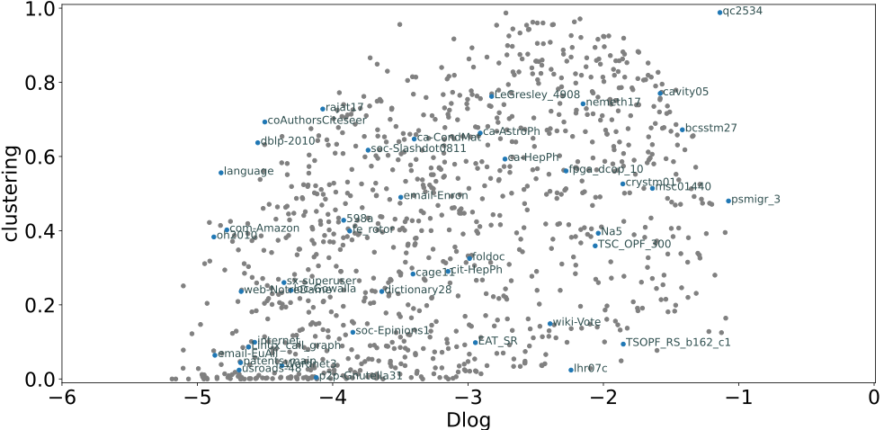

# Graphlaxy Dataset Generator

## About

This is a tool used to create synthetic graph datasets with an even distribution over a set of metrics (or projection) using \'Nash Bargain Scheme\'  optimization. It has a subcommand to generate the dataset with pre-trained parameters, a series of subcommands to train a new set of parameters, and subcommands to analyze the results (plots and statistics).

The metrics this project uses are the mean clustering coefficient (also known as transitivity) and the logarithm of the density. These metrics were selected because they are important for other studies of the investigation group, but the work can be extended to use other metrics.

This document and the associated paper are all the documentation available at the moment.

## Motivation (from abstract)

In general, to draw robust conclusions from a dataset, all the analyzed populations must be represented on said dataset. A dataset that does not fulfill this condition is normally referred to as selection bias. On the other hand, graphs have been used to model a wide variety of problems. Although synthetic graphs can be used to augment available real graph datasets to overcome selection bias, the generation of unbiased synthetic datasets is complex with current tools. In this work, we propose a method to find a synthetic graph dataset that has an even representation of graphs with different metrics. The resulting dataset can then be used, among others, for benchmarking graph processing techniques as the accuracy of different Graph Neural Network (GNN) models or the speedups obtained by different graph processing acceleration frameworks.

## Requirements and installation

For the moment the only way to use the software is to download the repository, install the dependencies and run the command-line tool.

This project has multiple dependencies. It uses the `networkit` package for the RMat implementation, `networkx` package to calculate the graph metrics, `scipy` package for the optimization problem, `matplotlib` for plots, and `pebble` package (optional) to control the multiprocess characteristics. It also uses the `numpy` and `pandas` packages. Not all dependencies are required to run all commands.

The repository has a `requirements.txt` to install with a single command all the dependencies:
```
pip install -r requirements.txt
```

If you want to run the command without extension on Linux use:

```
chmod +x gdg
```

## Quickstart

How to generate an evenly distributed dataset and use it.

### Generate dataset using default parameter distribution

This is probably the most common use case. If you only care to create a dataset with the already trained parameters, this is the section you were looking for.

To create the dataset using default parameters run:
```
python GraphlaxyDataGen.py -f <otput_folder> -s <dataset_size> -e <edge_size_min>,<edge_size_max> [-m]
```
or 
```
./gdg -f <otput_folder> -s <dataset_size> -e <edge_size_min>,<edge_size_max> [-m]
```

The `-m` option indicates to use multiprocess, omit if wish to run on one process (will only use one core if not used).


### Using the dataset

The following snippets can help you use the dataset once you have generated it.

The first one is about loading the dataset as networkx graphs:
```python
import networkx as nx
import os
from pathlib import Path

def read_graph(path):
  with open(path, 'r') as f:
    data = nx.readwrite.edgelist.read_edgelist(f)
  return data

def load_dataset(folder):
    graph_names = os.listdir(folder)
    for graph_name in graph_names:
        G = read_graph(Path(folder,graph_name))
        Gcc = max(nx.connected_components(G), key=len)
        yield {"name": graph_name, "graph": G.subgraph(Gcc)}
        
        
dataset = load_dataset("<dataset_folder>")
```
This second example is about loading the dataset as a GNN with random data and classes:

```python
import random
from torch_geometric.utils import from_networkx
import numpy as np

def to_torch_randomdata(dataset, features, classes):
    for d in dataset:
        G = d["graph"]
        for n in G.nodes():
            G.nodes[n]['features'] = list(np.random.rand(features).astype(np.float32))
            G.nodes[n]['classes'] = random.randint(0,classes - 1)
        gnn = from_networkx(G)
        gnn = to_sparse(gnn)
        yield {"name": d["name"], "gnn": gnn}
        
dataset = to_torch_randomdata(load_dataset("<dataset_folder>"), 10, 2)
```


## Documentation

### Training new parameters

To train new parameters three steps must be followed. First, a Baseline dataset must be created, then the metrics must be calculated over the Baseline dataset, and after that, the actual optimization problem must be run. Once the optimization is finished, a new dataset can be created using the trained parameters.

The steps are separated into three subcommands because each can take more than an hour (depending on the parameters), and each generates a resulting document, so they can be used independently of the rest of the process. This guide will not cover all the parameters on each step, use the `-h` on each command and subcommand to know all the available options.

To run all the processes at once in the background use:

```
nohup sh -c 'python3 -u GalaxyDataGen.py optimization baseline -f <baseline_dir> -m &&
  python3 -u GraphlaxyDataGen.py optimization metrics -f <baseline_dir> -m &&
  python3 -u GraphlaxyDataGen.py optimization optimize -f <baseline_dir> &&
  python3 -u GraphlaxyDataGen.py generate -f <result_dir> -F -p <baseline_dir>/optimized_parameters.csv -m &&
  python3 -u GraphlaxyDataGen.py optimization metrics -f <result_dir> -m' > ../log/complete_nohup.out &
```


The first step is to create the Baseline dataset, this will create the dataset and a `csv` with the path to each of the graphs and the parameters that were used to generate them:

```
./gdg optimization baseline -f <baseline_dir> [-m]
```

The second step is to calculate the metrics for the baseline dataset. This will create a second `csv` file with the metrics of each of the graphs:

```
./gdg optimization metrics -f <baseline_dir> [-m]
```

The next step is to run the optimization. This will create yet another `csv` file with the evolution of the parameters through the optimization process:

```
./gdg  optimization optimize -f <baseline_dir> -n <ID>
```

After that one can generate a dataset using the newly trained parameters (use the ID of the set of parameters you wish to use to generate the dataset):

```
./gdg generate -f <result_dir> -F -p <baseline_dir>/optimized_parameters.csv -n <ID> [-m]
```

And optionally, the metrics of the result dataset can be calculated (needed to generate some of the plots in the following section):

```
./gdg optimization metrics -f <result_dir> [-m]
```

For more details on the parameters use the `-h` option on each of the commands.

### Plots

Some plots can be generated using the tool also to analyze the obtained solution. 

The command to generate the plots is:

```
./gdg plot -f <dataset> -p <plot_id_1> <plot_id_2> ... [-sh]
```

Each plot id will generate a different plot. the `-sh` option shows the plot instead of saving it to the filesystem.
For example, to generate the result against the validation plot and show it, the command would be:

```
./gdg plot -f <result_dataset> -p validation -sh
```

A plot example representing a sample of the result dataset compared to the validation dataset on a projection over the analyzed metrics:




## Validation dataset

The validation dataset is not included, nor is the code used to download it. To download the dataset the package `ssgetpy` was used available [here](https://github.com/drdarshan/ssgetpy). This repository only includes a file with the metrics extracted from the dataset that is needed to generate the validation plot.


## The name

Graphlaxy comes from the idea that graphs as galaxies may seem similar from afar (especially big graphs), but doing a close inspection of its characteristics, one can see that in reality each of them is as complex as a galaxy.

The [Hubble Deep Field](https://en.wikipedia.org/wiki/Hubble_Deep_Field) images from NASA, show how that, apparently empty, space of the sky, with a less magnified image, seems like a collection of dots, is full of galaxies, and each of them has a peculiar shape and can be classified.

A parallelism can be found with this project that does zoom into the graphs by projecting them into a set of metrics, and in doing so it can distinguish between them. Also, there are a lot of galaxies, and this tool works with a lot of graphs.

## The Project

This work was done by the Barcelona Neural Network group (BNN) and is part of a series of projects that intend to investigate different aspects of GNNs. 


## Citing

This repository is associated with the paper ["Bias Reduction via Cooperative Bargaining in Synthetic Graph Dataset Generation"](https://arxiv.org/abs/2205.13901). If you are using it for a study, please cite. 

```
@inproceedings{Wassington2022BiasRV,
  title={Bias Reduction via Cooperative Bargaining in Synthetic Graph Dataset Generation},
  author={Axel Wassington and S. Abadal},
  year={2022}
}
```


## License
See [LICENSE](LICENSE) for the full license text.

```
Copyright Copyright 2020 Universitat Politècnica de Catalunya

Licensed under the Apache License, Version 2.0 (the "License");
you may not use this file except in compliance with the License.
You may obtain a copy of the License at

  http://www.apache.org/licenses/LICENSE-2.0

Unless required by applicable law or agreed to in writing, software
distributed under the License is distributed on an "AS IS" BASIS,
WITHOUT WARRANTIES OR CONDITIONS OF ANY KIND, either express or implied.
See the License for the specific language governing permissions and
limitations under the License.
```